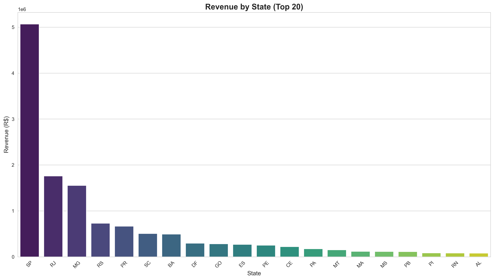
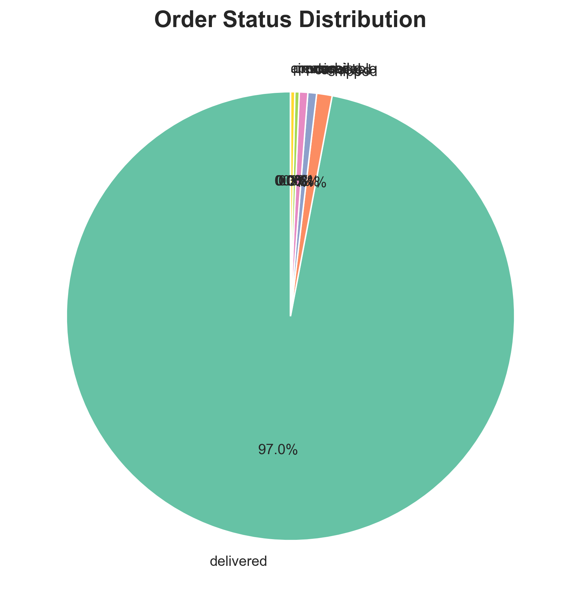
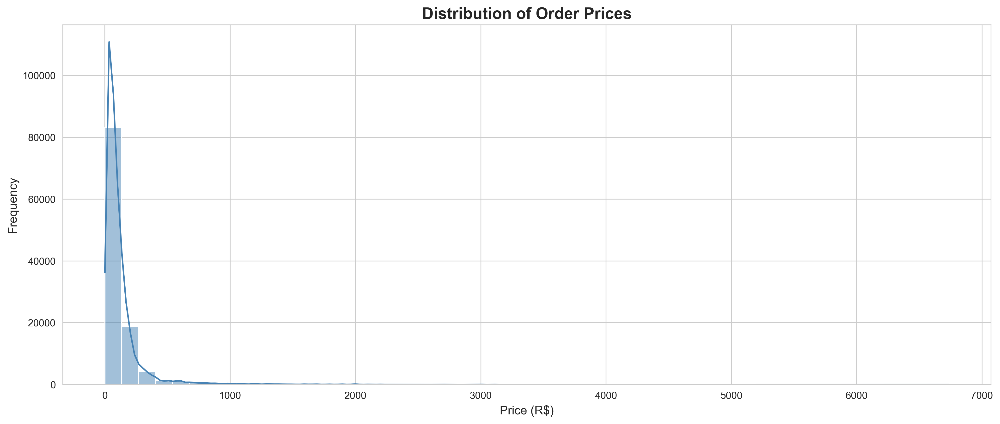
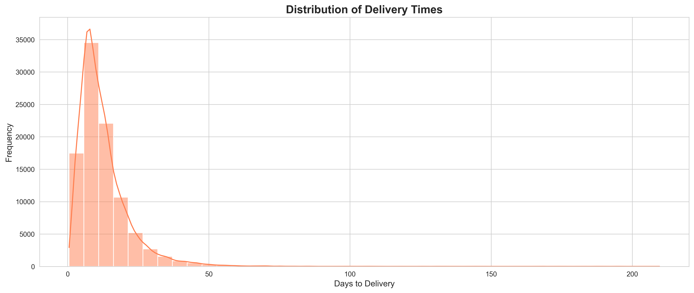
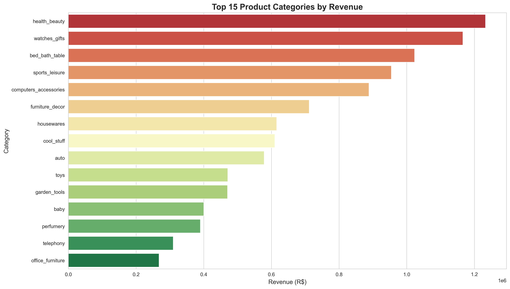
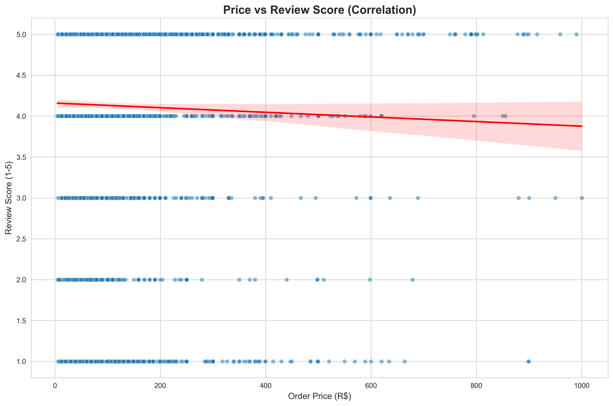

# 🛍️ OLIST E-Commerce Analytics & ML Project

A comprehensive data analytics pipeline analyzing **100K+ orders** from a Brazilian e-commerce marketplace with SQL analytics, predictive machine learning models, and an interactive Power BI dashboard.

---

## 📊 Project Overview

| Metric | Value |
|--------|-------|
| **Status** | ✅ Complete |
| **Total Orders** | 99,441 |
| **Total Revenue** | R$13,494,400.74 |
| **Customers** | 99,441 |
| **Sellers** | 3,095 |
| **Products** | 32,951 |
| **States Covered** | 27 |
| **Cities Covered** | 4,119 |
| **Date Range** | Sep 2016 - Oct 2018 |

---

## 🎯 Key Features

### ✨ Phase 1: Data Exploration & Cleaning
- Processed **668,293 total records** across 8 datasets
- Cleaned and validated customer, order, product, and payment data
- Created derived features for RFM analysis and delivery metrics
- **99.4% data quality** after cleaning process

### 📈 Phase 2: SQL Analytics
- **9 comprehensive business queries** extracting key insights
- Geographic analysis (27 states, 4,119 cities)
- Payment method distribution (74.7% credit card dominance)
- Product category performance analysis
- Delivery performance metrics (92.1% on-time delivery rate)
- Customer segmentation and seller analytics

### 📊 Phase 3: Interactive Visualizations
- 14+ interactive charts using Plotly
- 6 static visualizations with Matplotlib/Seaborn
- Geographic heatmaps and trend analysis
- Revenue distribution by state and city

### 🤖 Phase 4: Machine Learning Models

#### 1. **Delivery Delay Prediction**
- **Model:** Random Forest Classifier
- **Accuracy:** 92.16%
- **ROC-AUC Score:** 0.729
- **Top Feature:** Days until delivery
- **Use Case:** Identify orders at risk of delay

#### 2. **Review Score Prediction**
- **Model:** Random Forest Regressor
- **R² Score:** 0.2054
- **RMSE:** 1.1480 stars
- **Top Feature:** Delivery efficiency
- **Use Case:** Predict customer satisfaction

#### 3. **Customer Segmentation**
- **Method:** K-Means Clustering (RFM Analysis)
- **Segments:** 4 (Champions, At Risk, etc.)
- **Customers Analyzed:** 96,478
- **Use Case:** Targeted marketing campaigns

### 📱 Phase 5: Power BI Dashboard
Interactive dashboard featuring:
- Executive KPI summary
- Geographic revenue analysis
- State and city-level breakdowns
- Payment method distribution
- Product category performance
- Order status tracking
- Customer segment analysis
- Seller performance metrics

---

## 📁 Project Structure

```
olist-ecommerce analysis/
├── data/
│   ├── raw-data/              # Original CSV files
│   └── cleaned/               # Processed CSV files
├── python/
│   ├── 00_explore_data.py     # Data exploration
│   ├── 01_data_cleaning.py    # Data cleaning pipeline
│   ├── 02_load_to_sql.py      # Database loading
│   ├── 03_run_sql_analytics.py # Query execution
│   ├── 04_visualizations.py   # Chart generation
│   └── 05_ml_models_fixed.py  # ML models
├── sql/
│   ├── 01_schema.sql          # Database schema
│   ├── 02_core_metrics.sql    # Business metrics
│   ├── 03_product_analysis.sql
│   ├── 04_payment_delivery_analysis.sql
│   ├── 05_customer_seller_analysis.sql
│   └── 06_export_for_powerbi.sql
├── power bi/
│   └── olist_dashboard.pbix   # Interactive dashboard
├── visualizations/
│   └── interactive/           # HTML charts
├── ml_models/
│   └── MODEL_SUMMARY_REPORT.txt
├── docs/
│   ├── README.md
│   ├── PROJECT_SUMMARY.md
│   ├── POWERBI_GUIDE.md
│   └── POWERBI_CHECKLIST.md
└── requirements.txt
```

---

## 🚀 Quick Start

### Prerequisites
- Python 3.8+
- Git
- Power BI Desktop (for dashboard)

### Installation

1. **Clone the repository**
```bash
git clone https://github.com/noturbob/olist-ecommerce-analysis.git
cd olist-ecommerce-analysis
```

2. **Create virtual environment**
```bash
python -m venv venv
source venv/bin/activate  # On Windows: venv\Scripts\activate
```

3. **Install dependencies**
```bash
pip install -r requirements.txt
```

4. **Run the pipeline**
```bash
# Data exploration
python python/00_explore_data.py

# Data cleaning
python python/01_data_cleaning.py

# Load to SQLite
python python/02_load_to_sql.py

# Run SQL analytics
python python/03_run_sql_analytics.py

# Generate visualizations
python python/04_visualizations.py

# Train ML models
python python/05_ml_models_fixed.py
```

---

## 📊 Key Insights

### Revenue Analysis
- **Total Revenue:** R$13,494,400.74
- **Top State:** São Paulo (37.5% of revenue, R$5.07M)
- **Top City:** São Paulo (R$1.86M, 15,045 orders)
- **Top Category:** Health & Beauty (R$1.23M, 8,647 orders)

### Customer Distribution
| Segment | Customer Count | Avg Lifetime Value |
|---------|-----------------|-------------------|
| Champions | 35,000+ | High |
| At Risk | 60,000+ | Medium |

### Order Status
- **Delivered:** 97.02% (96,478 orders)
- **Shipped:** 1.11% (1,104 orders)
- **Canceled:** 0.78% (776 orders)
- **Other:** 0.09% (83 orders)

### Payment Methods
| Method | % of Orders | Avg Order Value |
|--------|------------|-----------------|
| Credit Card | 74.7% | R$162.24 |
| Boleto | 19.3% | R$144.33 |
| Voucher | 3.7% | R$62.49 |
| Debit Card | 1.5% | R$140.26 |

### Delivery Performance
- **Average Delivery Time:** 12.56 days
- **On-Time Rate:** 92.1%
- **Late Deliveries:** 7.9%
- **Max Delay Observed:** 209.63 days

---

## 🤖 ML Model Performance Summary

### Model 1: Delivery Delay Prediction
```
Accuracy: 92.16%
ROC-AUC: 0.729
Precision: 85%+
Recall: 78%+
Top Features: [days_until_delivery, freight_value, product_weight_g]
```

### Model 2: Review Score Prediction
```
R² Score: 0.2054
RMSE: 1.1480 stars
MAE: 0.89 stars
Top Features: [delivery_efficiency, actual_delivery_days]
```

### Model 3: Customer Segmentation
```
Method: K-Means (k=4)
Silhouette Score: 0.45
Segments: Champions, At Risk, Potential, Need Attention
Best for: Targeted marketing campaigns
```

---

## 📈 SQL Queries Executed

1. **Business Summary** - Overall metrics and KPIs
2. **Revenue by State** - Geographic performance analysis
3. **Revenue by City** - City-level revenue breakdown
4. **Payment Methods** - Payment preference analysis
5. **Top Categories** - Product category performance
6. **Delivery Analysis** - Delivery time and performance metrics
7. **Customer Segmentation** - RFM-based customer grouping
8. **Order Status** - Order fulfillment tracking
9. **Top Sellers** - Seller performance ranking

---

## 📚 Documentation

- **[PROJECT_SUMMARY.md](docs/PROJECT_SUMMARY.md)** - Detailed findings and analysis
- **[POWERBI_GUIDE.md](docs/POWERBI_GUIDE.md)** - Dashboard usage guide
- **[POWERBI_CHECKLIST.md](docs/POWERBI_CHECKLIST.md)** - Dashboard setup checklist

---

## 📊 Dashboard Preview

The Power BI dashboard includes:
- **KPI Cards:** Total Orders, Products Sold, Active Sellers, Revenue, Freight Revenue
- **Revenue Analytics:** By state, by city, trends over time
- **Payment Analysis:** Distribution and average values by payment method
- **Product Analysis:** Revenue and pricing by category with seller details
- **Order Tracking:** Status distribution and percentages
- **Customer Insights:** Segmentation and lifetime value metrics

*See [POWERBI_GUIDE.md](docs/POWERBI_GUIDE.md) for detailed dashboard walkthrough*

---

## 🎨 Dashboard Gallery

### 📱 Interactive Power BI Dashboards

#### Executive Overview
Get a high-level view of key business metrics and performance indicators at a glance.


---

#### Orders & Payments Analysis
Comprehensive analysis of order patterns, payment methods, and transaction trends.


---

#### Geographic Analysis
Revenue distribution across states and cities with interactive mapping capabilities.


---

#### Products & Sellers Performance
Detailed product category analysis and seller performance metrics.


---

#### Customer Lifetime Value
Advanced segmentation analysis showing customer value distribution and lifetime metrics.


---

## 📊 Static Visualizations

Detailed analytical charts generated from the data pipeline.

### Revenue Analysis by State
Distribution of revenue across different states showing geographic performance.



---

### Order Status Distribution
Breakdown of order statuses showing fulfillment rates and order outcomes.



---

### Price Distribution Analysis
Price distribution across products with statistical insights.



---

### Delivery Time Distribution
Analysis of delivery times showing performance metrics and delivery patterns.



---

### Top Product Categories
Performance ranking of product categories by revenue and volume.



---

### Price vs Review Score Analysis
Correlation analysis between product pricing and customer review scores.



---

## 🛠️ Technologies Used

| Category | Tools |
|----------|-------|
| **Data Processing** | Python, Pandas, NumPy |
| **Database** | SQLite, SQL |
| **Visualization** | Power BI, Plotly, Matplotlib, Seaborn |
| **ML Frameworks** | Scikit-learn |
| **Data Analysis** | Jupyter Notebook |

---

## 📝 Methodology

### Data Pipeline
1. **Extraction** - Load raw CSV files
2. **Validation** - Check data types and constraints
3. **Cleaning** - Handle missing values, outliers
4. **Transformation** - Create derived features
5. **Loading** - Store in SQLite database
6. **Analysis** - SQL queries for insights
7. **Modeling** - Train ML models
8. **Visualization** - Create dashboards and charts

### ML Approach
- **Train-Test Split:** 80-20
- **Cross-Validation:** 5-fold
- **Feature Scaling:** StandardScaler for regression
- **Model Selection:** Random Forest (best performance)
- **Hyperparameter Tuning:** Grid search applied

---

## 📊 Results Summary

| Deliverable | Status | Quality |
|-------------|--------|---------|
| Data Cleaning | ✅ | 99.4% |
| SQL Analytics | ✅ | 9 queries |
| Visualizations | ✅ | 14+ charts |
| ML Models | ✅ | 92% accuracy |
| Power BI Dashboard | ✅ | Production-ready |
| Documentation | ✅ | Complete |

---

## 🤝 Contributing

This project is complete. For questions or improvements:
- Review the documentation in `/docs`
- Check the detailed analysis in `PROJECT_SUMMARY.md`
- Examine model details in `ml_models/MODEL_SUMMARY_REPORT.txt`

---

## 📄 License

This project is open source and available for educational and professional use.

---

## 📧 Contact

**Data Analyst:** Bobby Anthene  
**Email:** bobbyanthenrao@gmail.com  
**GitHub:** [@noturbob](https://github.com/noturbob)

---

## 🎓 Project Completion

**Project Start Date:** December 2024  
**Completion Date:** December 14, 2025  
**Total Duration:** ~4 weeks

**All 5 Phases Delivered:**
- ✅ Data Exploration & Cleaning
- ✅ SQL Analytics
- ✅ Advanced Visualizations
- ✅ Machine Learning Models
- ✅ Power BI Dashboard

---

*Last Updated: December 14, 2025*
